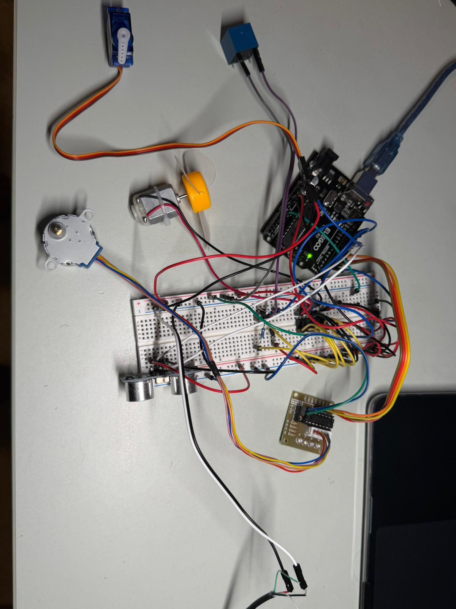
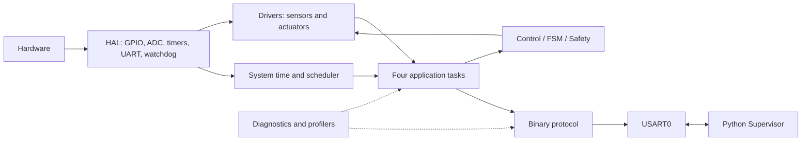
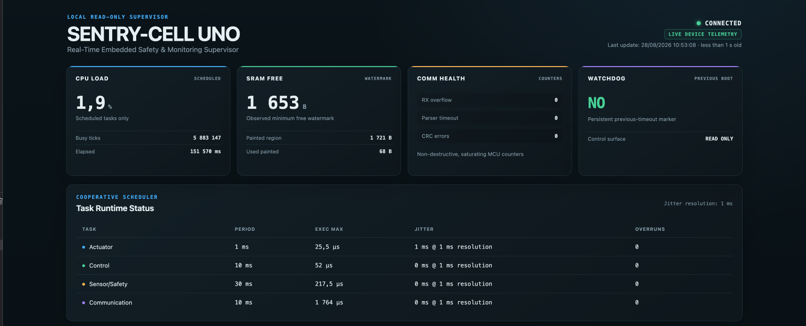
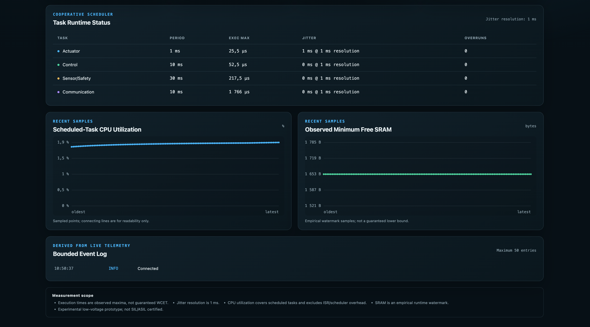

# SENTRY-CELL UNO

SENTRY-CELL UNO is a bare-metal ATmega328P embedded-control demonstrator built
around an Arduino UNO R3. It integrates sensors, four actuators, a cooperative
real-time architecture, local safety and diagnostics, a binary UART protocol,
and a Python standard-library supervisor. The project is supported by
requirements traceability, physical tests, fault injection, and recorded timing
and memory measurements.



## Overview

The project models a small experimental automation cell. A button controls its
operating state, a thermistor provides raw analog acquisition, an HC-SR04
provides local obstacle detection, and the firmware coordinates a stepper,
servo, DC motor, relay, and diagnostic LED. Safety remains local to the MCU and
does not depend on the host computer.

The engineering flow is:

> Measure → Decide → Act → Monitor → Detect Fault → Diagnose → Report → React → Safe State

The firmware is written in C11 without the Arduino framework, dynamic
allocation, or blocking application delays. Hardware access is encapsulated in
small HAL and driver modules, while application work is dispatched by a static
cooperative scheduler.

## System Demo

The final physical validation exercised this sequence:

1. `BOOT` initializes safe outputs and transitions to `IDLE`.
2. In `IDLE`, all external actuators remain stopped or at their safe command.
3. A D2 button press enters `ACTIVE`, enabling the integrated actuator policy.
4. A critical valid obstacle enters latched `SAFE_STATE`.
5. Removing the obstacle or pressing D2 does not restart an actuator.
6. A reset returns the system to `IDLE` with safe outputs.

The photograph above shows the final integrated low-voltage prototype. No demo
video is currently published.

## Key Features

- Direct ATmega328P register programming through focused AVR HAL modules.
- Static cooperative scheduler with exactly four periodic application tasks.
- Timer2 CTC system time with a 1 ms tick.
- Timer1 coexistence: HC-SR04 input capture, servo Compare A scheduling, and a
  2 MHz profiling/capture counter.
- Interrupt-driven USART0 RX and TX ring buffers.
- Versioned binary protocol with sequence IDs, bounded payloads, CRC-8/ATM,
  parser timeout, and resynchronization.
- Explicit `BOOT`, `IDLE`, `ACTIVE`, and latched `SAFE_STATE` FSM.
- Local obstacle safety, retained fault diagnostics, and saturating
  communication-health counters.
- Hardware watchdog validation through a controlled stall and safe recovery.
- Python supervisor using only the standard library.
- Runtime timing, jitter, SRAM-watermark, scheduled-task utilization, and
  execution-overrun telemetry.
- Communication and watchdog fault-injection modes.
- Requirements, tests, physical evidence, build identity, and measurement
  traceability for the final validation baseline.

## Hardware

| Device | Interface / power path | Integrated role |
|---|---|---|
| Arduino UNO R3 / ATmega328P | 16 MHz, nominal 5 V logic | Bare-metal controller |
| Push button | D2 with internal pull-up | IDLE/ACTIVE request |
| HC-SR04 | D7 trigger, D8/ICP1 echo | Local obstacle input |
| Thermistor | A0/ADC0 | Raw ADC acquisition |
| Stepper motor | D3–D6 through ULN2003 | Sequenced motion |
| SG90 servo | D9 signal, external nominal 5 V power | Active/safe position command |
| DC motor and fan | D10/D12 through L293D | Experimental cooling in ACTIVE |
| 5 V relay | D11 through resistor, PN2222, and flyback diode | Low-voltage switched output |
| Built-in LED | D13 | State and diagnostic indication |
| USB serial link | USART0 | Python supervisor connection |

No DHT11, LCD, RGB LED, or buzzer is part of the current integrated baseline.
The read-only dashboard is a host-side observer and does not change the
validated firmware baseline.

## Final Pin Map

| Arduino pin | ATmega328P signal | Function |
|---|---|---|
| D2 | PD2 | Button input with internal pull-up |
| D3 | PD3 | Stepper ULN2003 IN1 |
| D4 | PD4 | Stepper ULN2003 IN2 |
| D5 | PD5 | Stepper ULN2003 IN3 |
| D6 | PD6 | Stepper ULN2003 IN4 |
| D7 | PD7 | HC-SR04 TRIG |
| D8 | PB0 / ICP1 | HC-SR04 ECHO / Timer1 Input Capture |
| D9 | PB1 / OC1A | Servo signal |
| D10 | PB2 | DC motor L293D input |
| D11 | PB3 | Relay transistor drive |
| D12 | PB4 | DC motor L293D input |
| D13 | PB5 | Built-in LED |
| A0 | PC0 / ADC0 | Thermistor raw ADC |
| USB serial | USART0 | Python supervisor |

## Firmware Architecture



The repository mirrors these responsibilities:

- `firmware/hal/`: register-level GPIO, ADC, time, timing, UART, and watchdog.
- `firmware/drivers/`: button, LED, thermistor, HC-SR04, stepper, servo, DC
  motor, and relay abstractions.
- `firmware/scheduler/`: fixed-size cooperative task table.
- `firmware/app/`: system FSM.
- `firmware/safety/`: hardware-independent obstacle decision.
- `firmware/diagnostics/`: fault retention and timing/memory/runtime profilers.
- `firmware/protocol/`: frame parser, response generation, and CRC-8.
- `firmware/main.c`: initialization and the four integrated application tasks.

Diagnostics are transverse to the task flow. The UART protocol connects the
firmware telemetry and test interface to the Python supervisor.

## Real-Time Architecture

| Task | Period | Main responsibility |
|---|---:|---|
| `actuator_service_task` | 1 ms | Stepper service; advances the stepper every 5 ms while ACTIVE |
| `control_task` | 10 ms | Button edge handling, state-dependent outputs, diagnostic LED |
| `sensor_safety_task` | 30 ms | Raw thermistor read, HC-SR04 acquisition, obstacle safety decision |
| `communication_task` | 10 ms | Parser service, responses, telemetry, controlled watchdog request |

The scheduler is cooperative: tasks run to completion and must remain bounded.
Timing-critical peripheral work is kept in short ISRs: Timer2 advances the 1 ms
time base, Timer1 captures the ultrasonic echo and schedules servo pulse edges,
and USART interrupts move bytes through bounded rings. ADC conversion waiting is
short and bounded; the application contains no artificial blocking delay.

## Safety and Diagnostics

### State and output policy

| State | Stepper | DC motor | Relay | Servo | LED |
|---|---|---|---|---|---|
| `BOOT` / default | STOP | STOP | OFF | SAFE | OFF |
| `IDLE` | STOP | STOP | OFF | SAFE | OFF |
| `ACTIVE` | RUN | FORWARD | ON | ACTIVE | ON |
| `SAFE_STATE` | STOP | STOP | OFF | SAFE | Diagnostic pattern |

A valid integer HC-SR04 result from 1 through 20 cm while `ACTIVE` raises a
critical obstacle event. The FSM then enters `SAFE_STATE`, safe outputs are
applied, button requests are ignored, and the state remains latched until reset.

The physical switching boundary was observed around 21.8–22.0 cm. This is an
empirical sensor/system characteristic caused by the measurement chain and
integer conversion; it is not a claim of centimetre-level calibration and does
not change the logical 1–20 cm decision boundary.

Diagnostics retain the last critical fault and a fault count across read
operations. Communication health exposes saturating UART RX overflow, parser
timeout, and CRC-error counters.

### Watchdog recovery

The ATmega328P hardware watchdog was validated with this real sequence:

```text
controlled firmware block
    -> watchdog interrupt
    -> persistent .noinit marker
    -> watchdog hardware reset
    -> safe reboot to IDLE
    -> PING recovery
    -> persistent watchdog marker detected
```

The raw boot reset-cause value `0xF7` is retained as informational data only; it
is not interpreted as a WDRF indication.

## Communication Protocol

USART0 runs at **9600 baud, 8N1**. RX uses a 32-byte ring with 31 useful bytes;
TX uses a 64-byte ring with 63 useful bytes. The runtime protocol path uses the
RX and UDRE interrupts rather than polling waits in the communication task.

```text
SOF | VERSION | TYPE | SEQUENCE | LENGTH | PAYLOAD | CRC
```

| Parameter | Value |
|---|---|
| SOF | `0xA5` |
| Version | `0x01` |
| Maximum payload | 8 bytes |
| Parser inter-byte timeout | 100 ms |
| CRC | CRC-8/ATM |
| Polynomial | `0x07` |
| Initial value | `0x00` |
| Reflection | None |
| XOR-out | `0x00` |
| CRC coverage | `VERSION` through `PAYLOAD`; excludes `SOF` |

Implemented request/response paths include:

- `PING` / `PONG`
- `ECHO` / `ACK`, plus `NACK` for invalid length or unsupported type
- `COMM_STATUS`
- `TIMING_STATUS`
- `JITTER_STATUS`
- `RUNTIME_MEMORY_STATUS`
- `CPU_LOAD_STATUS`
- `OVERRUN_STATUS`
- `RESET_CAUSE` (informational)
- `WATCHDOG_STATUS`
- controlled watchdog-block fault-injection request

## Python Supervisor

The supervisor uses Python standard-library modules only (`os`, `termios`,
`select`, `argparse`, `csv`, `hashlib`, and related standard modules). Every
mode requires an exact serial device path.

```bash
# Default PING/PONG and ECHO/ACK bring-up
python3 supervisor/main.py --port /dev/cu.usbmodem1101

# Communication counters
python3 supervisor/main.py --port /dev/cu.usbmodem1101 --status

# Controlled watchdog reset test
python3 supervisor/main.py --port /dev/cu.usbmodem1101 --watchdog-test

# Physical single-session validation profiler
python3 supervisor/main.py --port /dev/cu.usbmodem1101 --validation-profile

# Read-only local dashboard
python3 supervisor/main.py --port /dev/cu.usbmodem1101 --dashboard
```

`/dev/cu.usbmodem1101` is an example only. Discover and supply the exact port;
do not assume that the device name is stable.

Available modes verified in `supervisor/main.py` are:

| Mode | Purpose |
|---|---|
| default | PING/PONG and ECHO/ACK bring-up |
| `--status` | Communication-health counters |
| `--timing` | Task execution-time maxima |
| `--jitter` | Scheduler start-interval jitter maxima |
| `--memory-runtime` | Runtime SRAM watermark observation |
| `--rt-profile` | Scheduled-task utilization and overruns |
| `--monitor` | Finite health monitoring with CSV output |
| `--fault-injection-comm` | Bad-CRC and partial-frame fault campaign |
| `--watchdog-test` | Controlled hardware-watchdog reset campaign |
| `--validation-profile` | Host-timed IDLE/ACTIVE/SAFE measurement campaign |
| `--dashboard` | Read-only local browser dashboard using live protocol telemetry |

`--samples`, `--interval`, `--observe-seconds`, and `--csv` configure the
relevant modes. Opening the serial port may reset the UNO through DTR.

> **Test caution:** `--watchdog-test` intentionally blocks the firmware and
> causes a hardware reset. `--validation-profile` creates a new exclusive,
> timestamped `measurements/val_req_027_campaign_YYYY-MM-DD_HHMMSS.txt` file;
> a numeric suffix prevents collisions. Existing campaigns are never
> overwritten. The canonical PHASE 15 campaign is immutable, and
> `measurements/val_req_027_current_build.txt` is a curated traceability index.

## Live Supervisor Dashboard



*Example live dashboard session with real Arduino telemetry.*

The dashboard runs locally at `http://127.0.0.1:8080` and is strictly
read-only. One persistent `SerialLink` is owned by the polling worker; HTTP
requests read a synchronized cache and never transact directly with USART0.
Loopback is the safe default. Binding `--dashboard-host` to a non-loopback
interface exposes this read-only telemetry UI to the reachable network; there
is no built-in authentication or TLS, so remote binding should be intentional
and limited to a trusted environment. No actuator-control endpoint exists.

It presents only existing protocol telemetry:

- `COMM_STATUS`, `TIMING_STATUS`, `JITTER_STATUS`;
- `RUNTIME_MEMORY_STATUS`, `CPU_LOAD_STATUS`, `OVERRUN_STATUS`;
- `WATCHDOG_STATUS`;
- scheduled-task CPU and empirical SRAM-watermark charts;
- a bounded telemetry-derived event log;
- explicit live, stale, degraded, and disconnected indications.

After a host serial timeout, the visible warning is retained. Recovery waits a
bounded 114.6 ms, purges stale host RX data without reopening the serial port or
toggling DTR, abandons the incomplete polling cycle, and resumes on the next
scheduled cycle.



The dashboard does **not** currently receive FSM state, HC-SR04 distance, or
actuator states. Those behaviors are verified physically during the demo. Live
dashboard-session values are empirical observations and are not substitutes
for the canonical PHASE 15 measurements.

Start it with the exact detected serial port:

```bash
python3 supervisor/main.py \
  --port /dev/cu.usbmodem1101 \
  --dashboard
```

Then open [http://127.0.0.1:8080](http://127.0.0.1:8080). The serial path shown
above is only an example and may change after reconnecting the UNO.

Real verification included an IDLE soak exceeding five minutes with no observed
`SerialTimeoutError`, zero MCU communication counters, and zero task overruns;
an ACTIVE test with all integrated actuators powered; and the complete physical
IDLE → ACTIVE → latched SAFE_STATE sequence while the dashboard remained
operational.

See the [reproducible demo runbook](docs/demo/demo_runbook.md) for preparation,
bring-up, live dashboard, physical Safety, and optional watchdog demonstrations.

## Build and Upload

Firmware prerequisites are GNU Make, `avr-gcc`, `avr-objcopy`, `avr-size`, and
`avrdude`. Host-side Supervisor and test execution require Python 3.10 or newer
(standard library only); the two C unit tests require a C11 host compiler. The
default firmware build targets `atmega328p` at `F_CPU=16000000UL`.

```bash
make clean
make
make size
```

The Makefile requires the serial port explicitly for upload:

```bash
make upload PORT=/dev/cu.usbmodem1101
```

The port shown is an example. Confirm the actual device path, keep external
actuator power OFF during upload, and never change fuses, EEPROM, or lock bits
as part of this workflow.

## Validation Results

**FINAL SYSTEM VALIDATION: PASS**

- Authoritative baseline: 35 VAL-REQ total.
- MUST requirements: **29/29 SATISFIED**.
- SHOULD requirements: 6, non-blocking under the approved baseline.
- Blocking MUST gaps: **NONE**.
- Final integrated BOOT → IDLE → ACTIVE → SAFE_STATE campaign: PASS.

See the [Final System Validation Report](docs/validation/final_system_validation_report.md)
and [Validation Requirements Baseline](docs/requirements/validation_requirements_v1.md).
This result validates the defined experimental scope; it is not a product or
safety certification.

## Measured Performance

The values below are **observed / empirical** results from the canonical PHASE
15 campaign on the identified final build. They are campaign observations, not
timing or resource bounds for every possible execution.

| Measurement | Canonical observed result | Scope |
|---|---:|---|
| Actuator task maximum | 22 us | 44 Timer1 ticks |
| Control task maximum | 51.5 us | 103 Timer1 ticks |
| Sensor/Safety task maximum | 217.5 us | 435 Timer1 ticks |
| Communication task maximum | 78 us | 156 Timer1 ticks |
| Scheduler jitter | No jitter ≥ 1 ms observed | 1 ms measurement resolution |
| Scheduled-task CPU utilization | 1.6% | Excludes ISR and scheduler overhead |
| Flash used | 6896 / 32768 B (21.04%) | `.text + .data` |
| Static SRAM used | 290 / 2048 B (14.16%) | `.data + .bss`, before runtime stack/heap |
| Runtime SRAM watermark | 1659 B minimum free observed | Empirical campaign watermark |
| Task execution overruns | 0 for all four tasks | Observed during the canonical campaign |

Canonical build sections: `.text = 6886 B`, `.data = 10 B`, `.bss = 280 B`,
`dec = 7176 B`.

The canonical record is
[`measurements/val_req_027_campaign_2026-08-27_202840.txt`](measurements/val_req_027_campaign_2026-08-27_202840.txt).

## Testing and Fault Injection

The repository contains:

- `tests/test_safety.c`: eight boundary cases against the real production
  Safety module; 8/8 PASS in the validation evidence.
- `tests/test_diagnostics.c`: eight cases against the real diagnostics module;
  8/8 PASS, including non-destructive reads.
- Five Python `unittest` files with 82 current tests covering protocol,
  monitoring, fault-injection helpers, validation-campaign formatting, and the
  read-only dashboard with host-side serial recovery.
- Real PING/PONG, ECHO/ACK, parser recovery, and communication-health checks.
- Automated bad-CRC and partial-frame timeout injection with recovery evidence.
- A controlled watchdog fault-injection command and physical recovery test.

Run the current automated host regressions without writing Python bytecode:

```bash
PYTHONDONTWRITEBYTECODE=1 python3 -m unittest discover -s supervisor/tests -v

cc -std=c11 -Wall -Wextra -Werror -Ifirmware \
  tests/test_safety.c firmware/safety/safety.c \
  -o /tmp/sentry-cell-test-safety
/tmp/sentry-cell-test-safety

cc -std=c11 -Wall -Wextra -Werror -Ifirmware \
  tests/test_diagnostics.c firmware/diagnostics/diagnostics.c \
  -o /tmp/sentry-cell-test-diagnostics
/tmp/sentry-cell-test-diagnostics

rm -f /tmp/sentry-cell-test-safety /tmp/sentry-cell-test-diagnostics
```

Relevant persisted results include
[`measurements/comm_health.csv`](measurements/comm_health.csv) and
[`measurements/fault_injection_comm.csv`](measurements/fault_injection_comm.csv).

## Electrical Safety

> **LOW-VOLTAGE PROTOTYPE ONLY. NEVER CONNECT THE RELAY CONTACTS OR ANY PART OF
> THIS PROTOTYPE TO 230 V OR OTHER MAINS VOLTAGE.**

- Arduino logic rail: nominal 5 V, measured approximately **4.8 V**.
- External actuator rail: nominal 5 V, measured approximately **4.9 V**.
- Arduino and actuator grounds are common.
- Servo power is external; D9 is a signal only.
- Stepper power passes through the ULN2003; D3–D6 are command signals.
- DC motor power passes through the L293D; D10/D12 are command signals.
- The relay coil is switched by a PN2222 through a base resistor, with a
  flyback diode across the coil.
- No power actuator is supplied directly from an MCU GPIO.

The prototype is experimental and is not SIL/ASIL or EMC/EMI certified. Read
the [Electrical Safety Evidence](docs/hardware/electrical_safety_evidence.md)
and [Pre-Power Checklist](docs/validation/pre_power_checklist.md) before
rewiring or powering the integrated system.

## Repository Structure

```text
.
├── firmware/
│   ├── app/             # System FSM
│   ├── diagnostics/     # Fault and runtime profiling
│   ├── drivers/         # Sensors and actuators
│   ├── hal/             # AVR register-level services
│   ├── protocol/        # Binary framing and CRC
│   ├── safety/          # Obstacle decision
│   ├── scheduler/       # Cooperative scheduler
│   └── main.c           # Integrated application
├── supervisor/
│   ├── dashboard_static/ # Offline dashboard HTML/CSS/JavaScript
│   ├── tests/            # Python unittest suite
│   ├── dashboard.py      # Cached polling worker and local HTTP server
│   └── main.py           # Supervisor entry point
├── tests/               # Host-side production-module C tests
├── docs/
│   ├── architecture/    # System layers, resources, tasks, and FSM
│   ├── protocol/        # Binary UART protocol reference
│   ├── testing/         # Test strategy and reproducible commands
│   ├── hardware/        # Electrical evidence and final photos
│   ├── demo/            # Real dashboard captures and demo runbook
│   ├── requirements/    # Authoritative validation baseline
│   └── validation/      # Readiness, checklist, and final report
├── measurements/        # Canonical, repeatability, health, and fault records
├── build/               # Preserved validated ELF, HEX, and linker map
├── Makefile
├── .gitignore
├── LICENSE
└── README.md
```

## Evidence and Measurements

- [Canonical PHASE 15 campaign](measurements/val_req_027_campaign_2026-08-27_202840.txt)
- [Secondary repeatability campaign](measurements/val_req_027_campaign_2026-08-27_213529.txt)
- [VAL-REQ-027 campaign index](measurements/val_req_027_current_build.txt)
- [Final validation report](docs/validation/final_system_validation_report.md)
- [Validation readiness and requirement traceability](docs/validation/validation_readiness.md)
- [Validation requirements](docs/requirements/validation_requirements_v1.md)
- [Electrical evidence](docs/hardware/electrical_safety_evidence.md)
- [Hardware photographs](docs/hardware/photos/)

Both VAL-REQ-027 campaigns used the same ELF, HEX, and map hashes. The 20:28:40
run is the canonical PHASE 15 validation campaign; the 21:35:29 run is retained
as secondary repeatability evidence. Differences in observed maxima illustrate
normal empirical run-to-run variation.

## Known Limitations

- Experimental prototype; not SIL/ASIL certified.
- No EMC/EMI certification or detailed current-consumption characterization.
- No guaranteed brownout or electrical-noise margin.
- HC-SR04 distance is not calibrated to centimetre-level accuracy; the physical
  switching boundary was observed around 21.8–22.0 cm.
- Scheduled-task utilization excludes ISR execution and scheduler overhead.
- Jitter observation resolution is 1 ms; sub-millisecond variation is not
  resolved.
- Runtime SRAM watermark and execution maxima are empirical campaign values.
- The dashboard does not expose FSM state, HC-SR04 distance, or actuator states.
- No mains switching is implemented, permitted, or validated.
- Raw boot reset cause `0xF7` is informational and is not interpreted as WDRF.

## Roadmap / Next Work

- Add automated host-test execution in CI after repository publication.
- Package validated firmware artifacts and the demo runbook for releases.
- Calibrate the thermistor chain before defining any temperature-based action.
