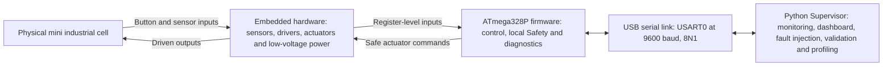
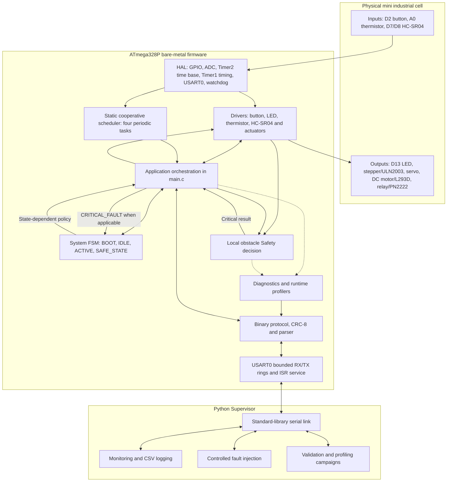
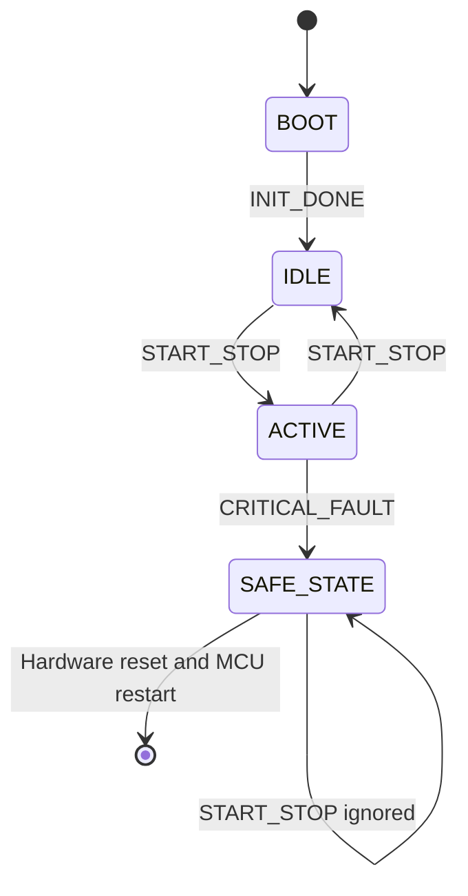
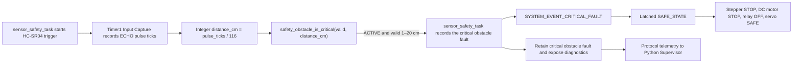
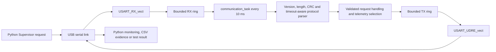

# SENTRY-CELL UNO — System Architecture

## 1. Purpose and scope

SENTRY-CELL UNO is a low-voltage experimental mini industrial cell built around
an Arduino UNO R3 and its ATmega328P. The system combines embedded hardware,
bare-metal firmware, local safety and diagnostics, a bounded binary serial
protocol, a Python Supervisor, and a read-only browser dashboard.

The engineering flow is:

> Measure → Decide → Act → Monitor → Detect Fault → Diagnose → Report → React → Safe State

This document describes the validated integrated architecture. It does not add
future components, change firmware behavior, or elevate empirical validation
results into formal real-time or safety-certification claims.

## 2. System context

The ATmega328P is the local control and Safety authority. The Python Supervisor
observes, requests telemetry, runs bounded test campaigns, and can request the
validated controlled watchdog fault injection. It is not an actuator controller
and is not required for the local obstacle Safety path to operate.

## 3. Firmware layers and repository mapping

The architecture is layered conceptually as **Hardware → HAL → Drivers →
Scheduler → Control/FSM/Safety → Application**. In the implementation, the
scheduler dispatches the application tasks, while those tasks coordinate the
control, FSM, Safety, drivers, diagnostics, and protocol. Diagnostics are a
transverse concern rather than a control layer.

| Layer / concern | Repository location | Responsibility |
|---|---|---|
| Hardware | Arduino UNO R3, sensors, interface stages and actuators | Physical inputs, low-voltage outputs and MCU peripherals |
| HAL | `firmware/hal/` | GPIO, ADC, 1 ms system time, Timer1 timing access, USART0 and watchdog register access |
| Drivers | `firmware/drivers/` | Button, LED, thermistor, HC-SR04, stepper, servo, DC motor and relay abstractions |
| Scheduler | `firmware/scheduler/` | Fixed four-slot cooperative periodic dispatch |
| Control / FSM / Safety | `firmware/app/` and `firmware/safety/` | Explicit system states, transitions and obstacle decision |
| Application | `firmware/main.c` | Safe initialization and orchestration of exactly four tasks |
| Diagnostics and profiling | `firmware/diagnostics/` | Fault retention, timing/jitter maxima, SRAM watermark, CPU and overrun observations |
| Protocol | `firmware/protocol/` | Bounded framed messages, CRC-8, parser timeout, requests and responses |
| Host supervision | `supervisor/` | Serial transport, monitoring, read-only dashboard, CSV evidence, fault injection and validation/profiling campaigns |

### Integrated architecture

The arrows describe data and control dependencies, not thread ownership. All
application functions run on the MCU; host requests reach them only through the
validated serial protocol path.

## 4. MCU resource map

The target is an **ATmega328P at 16 MHz**.

| MCU resource | Configuration | Architectural use |
|---|---|---|
| Timer2 | CTC mode, prescaler 64, `OCR2A = 249` | 1 kHz compare event and 1 ms `system_time_ms()` time base for the scheduler |
| Timer1 | Normal/free-running mode, prescaler 8 | 2 MHz counter with a 0.5 µs tick shared by HC-SR04 input capture, servo Compare A scheduling, and timing-profiler reads of `TCNT1` |
| USART0 | 9600 baud, 8 data bits, no parity, 1 stop bit | Interrupt-driven RX and TX transport for the binary protocol |
| ADC | AVcc reference, prescaler 128 | 10-bit raw ADC0/A0 thermistor acquisition at a 125 kHz ADC clock |
| Watchdog | Interrupt-and-reset mode, approximately 1 s | Normal-operation liveness supervision and controlled reset fault injection; `.noinit` magic markers provide bootloader-independent proof of the preceding watchdog timeout |
| GPIO | Direct register access encapsulated by HAL/drivers | Button, LED, sensor trigger/echo interfaces, and low-power control signals to actuator interface stages |

### Timer1 sharing contract

Timer1 is deliberately shared and must remain in normal mode at a /8 prescaler:

- HC-SR04 ECHO on ICP1 uses `TIMER1_CAPT_vect` and captured `ICR1` values.
- The servo uses `TIMER1_COMPA_vect` and increments `OCR1A` to schedule its
  high and low edges within an approximately 20 ms frame.
- Execution-time profiling reads the free-running `TCNT1` value and computes
  elapsed 16-bit tick differences.

`hcsr04_init()` establishes the Timer1 base before `servo_init()` enables
Compare A. No module may independently change Timer1 mode or prescaler without
coordinating all three consumers.

### Timer2 system-time contract

Timer2 Compare A occurs every 1 ms. `TIMER2_COMPA_vect` only increments the
32-bit millisecond counter; atomic foreground reads provide the time base used
by the scheduler and protocol timeout logic. Timer2 is not used for servo or
HC-SR04 timing.

### USART0 transport

USART0 uses `UBRR0 = 103` for 9600 baud in asynchronous normal mode. RX has a
32-byte ring with 31 usable slots; TX has a 64-byte ring with 63 usable slots.
The RX complete ISR stores received bytes and saturates the overflow counter.
The Data Register Empty ISR drains queued TX bytes and disables itself when the
ring becomes empty. The communication task parses RX bytes and enqueues framed
responses without a polling transmit wait in the runtime protocol path.

## 5. Final pin map

| Arduino pin | ATmega328P signal | Direction / role | External interface |
|---|---|---|---|
| D2 | PD2 | Input with internal pull-up; active-low button | Push button to GND |
| D3 | PD3 | Output; stepper IN1 | ULN2003 |
| D4 | PD4 | Output; stepper IN2 | ULN2003 |
| D5 | PD5 | Output; stepper IN3 | ULN2003 |
| D6 | PD6 | Output; stepper IN4 | ULN2003 |
| D7 | PD7 | Output; HC-SR04 trigger | HC-SR04 TRIG |
| D8 | PB0 / ICP1 | Timer1 input capture | HC-SR04 ECHO |
| D9 | PB1 | Servo control output | SG90 signal; servo power is external |
| D10 | PB2 | DC motor direction/control output | L293D input |
| D11 | PB3 | Active-high relay control output | Resistor → PN2222 → relay coil, with flyback diode |
| D12 | PB4 | DC motor direction/control output | L293D input |
| D13 | PB5 | Output | Built-in LED |
| A0 | PC0 / ADC0 | 10-bit raw analog input | Thermistor divider |
| USB serial | USART0 | Bidirectional serial transport | UNO USB-to-serial interface |

The GPIO pins provide logic/control signals only. The stepper, DC motor, relay
coil, and servo are not powered directly from MCU GPIO.

## 6. Cooperative scheduling model

The scheduler has a static table of exactly four entries. It is cooperative:
on each `scheduler_run()` pass, due tasks are called in registration order and
run to completion. There is no task preemption and no dynamic task creation.

| Task | Period | Main responsibilities |
|---|---:|---|
| `actuator_service_task` | 1 ms | Apply stepper service; while ACTIVE, advance one half-step when the 5 ms step interval expires; otherwise force STOP |
| `control_task` | 10 ms | Debounce-by-arming button press events, apply FSM-dependent actuator commands, and drive state/diagnostic LED behavior |
| `sensor_safety_task` | 30 ms | Read raw thermistor ADC0, start/complete or abort HC-SR04 acquisition, convert pulse ticks to integer distance, and evaluate local obstacle Safety while ACTIVE |
| `communication_task` | 10 ms | Service protocol timeout and RX parsing, enqueue responses/telemetry, and process the controlled watchdog-block request |

All four task-registration results are checked. If any registration fails, the
firmware applies safe outputs and remains in a safe infinite loop. Peripheral
ISRs are kept short; application policy remains in the foreground tasks.

The stored timing maxima, 1 ms-resolution jitter, scheduled-task CPU use, and
overrun counts are empirical campaign observations. They are not a formal WCET
analysis or a guarantee for every possible execution. Scheduled-task CPU use
also excludes ISR execution and scheduler overhead.

## 7. System FSM and safe-state policy

`SAFE_STATE` has no software transition out. A hardware reset starts a new
initialization sequence at `BOOT`, after which `INIT_DONE` enters `IDLE`.

| State | Stepper | DC motor | Relay | Servo | LED |
|---|---|---|---|---|---|
| `BOOT` / default | STOP | STOP | OFF | SAFE command | OFF |
| `IDLE` | STOP | STOP | OFF | 1 ms SAFE command | OFF |
| `ACTIVE` | RUN | FORWARD | ON | 2 ms ACTIVE command | ON |
| `SAFE_STATE` | STOP | STOP | OFF | 1 ms SAFE command | Diagnostic indication |

Safe-output initialization occurs before global interrupts are enabled. While
latched in `SAFE_STATE`, button start/stop events are ignored and actuator
motion cannot restart through the FSM.

## 8. Interrupt architecture

The integrated firmware contains these six ISR vectors:

| ISR | Module | Bounded responsibility |
|---|---|---|
| `TIMER2_COMPA_vect` | `firmware/hal/system_time.c` | Increment the millisecond system-time counter |
| `TIMER1_CAPT_vect` | `firmware/drivers/hcsr04.c` | Capture rising/falling ECHO ticks, switch edge selection, publish a completed pulse, and disable capture when done |
| `TIMER1_COMPA_vect` | `firmware/drivers/servo.c` | Toggle the servo signal edge and schedule the next Compare A interval |
| `USART_RX_vect` | `firmware/hal/uart.c` | Read `UDR0`, enqueue one RX byte, or saturate the overflow counter |
| `USART_UDRE_vect` | `firmware/hal/uart.c` | Transmit one queued byte or disable the empty-data interrupt |
| `WDT_vect` | `firmware/hal/watchdog.c` | Store the two `.noinit` watchdog-event markers before the following hardware reset |

No application decision is performed in these ISRs. The architecture does not
assign or claim software interrupt priorities beyond the ATmega328P hardware
behavior.

## 9. End-to-end data and control paths

### Local obstacle Safety path

The logical Safety decision is made from the integer distance delivered to the
Safety module. The documented physical switching boundary is a sensor/system
measurement characteristic, not centimetre-level calibration.

### Supervisor communication path

The host cannot write actuator GPIO or bypass the FSM/Safety policy. Normal
commands request protocol responses and diagnostic/profiling data. The
controlled watchdog-block request is a specific validated fault-injection path:
the communication task first applies safe outputs and then deliberately stops
foreground progress so the hardware watchdog can reset the MCU.

## 10. Architectural invariants

- Local obstacle Safety executes on the MCU and remains independent of the
  Python Supervisor.
- Safe-output policy overrides normal actuator operation in `SAFE_STATE` and
  on task-registration or controlled-watchdog failure paths.
- `SAFE_STATE` is latched until hardware reset; D2 cannot restart actuators
  while latched.
- No dynamic allocation is used; scheduler slots, protocol payloads, parser
  state, and UART rings have compile-time bounds.
- ISRs perform only short peripheral/state-transfer work; system policy runs in
  cooperative tasks.
- Timer1 sharing is explicit: normal mode, /8, HC-SR04 capture, servo Compare A,
  and profiling counter reads must coexist without reconfiguration.
- Timer2 is reserved for the 1 ms system time and scheduler time base.
- Power actuators are driven through ULN2003, L293D, or transistor interface
  stages and are never powered directly from GPIO.
- Communication loss or absence of the host cannot remove the local obstacle
  Safety path. No claim is made here that an optional communication-loss
  warning feature is implemented.
- Protocol input passes through bounded buffering and frame validation before
  foreground handling; the Python Supervisor has no direct actuator-control
  authority.

## 11. Known architectural limits

- The scheduler is cooperative, not a preemptive RTOS.
- Observed execution maxima, jitter, utilization, overruns, and SRAM watermark
  are empirical campaign measurements, not formal worst-case guarantees.
- Jitter evidence has 1 ms measurement resolution, so sub-millisecond variation
  is unresolved.
- Scheduled-task utilization excludes ISR work and scheduler overhead.
- The HC-SR04 chain is not calibrated to centimetre-level accuracy; its physical
  boundary must not be confused with the logical integer threshold.
- Thermistor acquisition is raw ADC only; no calibrated Celsius conversion or
  thermal Safety threshold is implemented.
- The system is a low-voltage experimental prototype. It is not a certified
  product, is not SIL/ASIL qualified, and has no EMC/EMI certification.
- No mains-voltage switching is present, permitted, or validated.
- The Python Supervisor is terminal-based and supervisory; it is not a Safety
  authority or a direct hardware-control layer.
- Timer1 sharing is intentionally coupled: changing its mode or prescaler would
  affect HC-SR04 capture, servo timing, and execution-time profiling together.

## 12. Related documentation

- [Project README](../../README.md)
- [Final System Validation Report](../validation/final_system_validation_report.md)
- [Electrical Safety Evidence](../hardware/electrical_safety_evidence.md)
